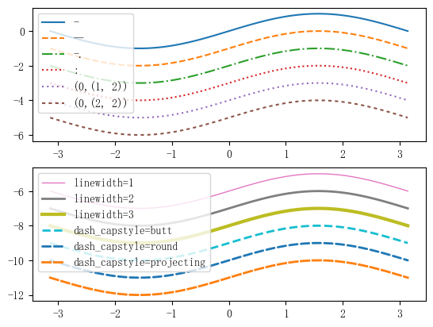

# 1 Matplotlib 基础使用
在数据科学和机器学习的工作流程中，数据可视化是不可或缺的一环。无论是探索数据模式，还是展示分析结果，一个好的可视化工具都可以极大地提升我们对数据的理解和决策能力。Matplotlib 是Python中最流行、功能最强大的可视化库之一。它不仅能帮助我们轻松创建各种类型的静态图表，还支持生成交互式和动画效果的可视化，从而满足不同场景下的需求。


## 1.1 下载Matplotlib

使用pip安装Matplotlib，命令如下：
```bash
pip install matplotlib -i https://pypi.tuna.tsinghua.edu.cn/simple/
```

## 1.2 Matplotlib的基本概念
Matplotlib的基本概念主要包括以下几个方面：
- Figure：整个图像窗口，所有的绘图区域都在其中
- Axes：实际绘图的子区域（可以划分为多个子区域），包括坐标轴、图例、标题等。
- Axis：坐标轴，包括x轴、y轴，用于显示数据范围。
- Artist：所有在图中绘制的图形对象，包括简单的点、线条、文本、图像等。
如下图所示：


## 1.3 Matplotlib的绘图流程
Matplotlib的绘图流程主要包括以下几个步骤：
1. 创建Figure对象
2. 绘制图形
3. 设置坐标轴
4. 添加图例、标题等
5. 显示图形或保存图形

一个简单的Matplotlib绘图示例代码如下：
```python
import matplotlib.pyplot as plt     # 导入Matplotlib库
import numpy as np                  # 导入NumPy库，用于生成和处理数据

# 画一个正弦曲线和余弦曲线
x = np.linspace(-np.pi, np.pi, 100)  # 生成-π到π之间的100个等间距的数据
y1 = np.sin(x)                       # 计算正弦值
y2 = np.cos(x)                       # 计算余弦值

# 创建Figure对象
plt.figure(figsize=(8, 6))

# 绘制图形
# plot()函数用于绘制曲线，参数分别为x轴数据、y轴数据、标签、颜色、线型、线宽
plt.plot(x, y1, label='sin(x)', color='r', linestyle='-', linewidth=2)  # 绘制正弦曲线
plt.plot(x, y2, label='cos(x)', color='b', linestyle='--', linewidth=2) # 绘制余弦曲线

# 设置坐标轴
plt.xlabel('x')                      # 设置x轴标签
plt.ylabel('y')                      # 设置y轴标签
plt.xlim(-np.pi, np.pi)              # 设置x轴范围
plt.ylim(-1, 1)                      # 设置y轴范围

# 添加图例、标题
plt.legend()                         # 显示图例
plt.title('Sin and Cos Curve')       # 设置标题

plt.show()                          # 显示图形
```


## 1.4 Matplotlib的绘图样式简介

### 1.4.1 颜色


Matplotlib中通过函数的 `color` 参数控制，并且提供了多种颜色设置方式如下：

- 'Cn'默认颜色循环：C0、C1、C2、C3、C4、C5、C6、C7、C8、C9
- 'x'单字母表示：b（蓝色）、g（绿色）、r（红色）、c（青色）、m（洋红）、y（黄色）、k（黑色）、w（白色）
- 'name' 颜色名称：'blue'、'green'、'red'、'cyan'、'magenta'、'yellow'、'black'、'white'...
- '#rrggbb' 十六进制RGB：'#000000'（黑色）、'#FF0000'（红色）、'#00FF00'（绿色）、'#0000FF'（蓝色）...
- (R, G, B[ ,A]) 0.0 到 1.0 之间的RGBA元组：(0,0,0)（黑色）、(1,0,0)（红色）、(0,1,0)（绿色）、(0,0,1)（蓝色）...
- 'x.y' 0.0 到 1.0 之间的灰度值：'0'（黑色）、'0.5'（灰色）、'1'（白色）

所有的的颜色名称如下图所示：


`'name'` 提供的颜色不满足你的需求时，可以使用 `(R, G, B[ ,A])` 或 `#rrggbb` 来自定义颜色。下面的程序演示了如何使用各种颜色设置方式进行绘图：

```python

import matplotlib.pyplot as plt
import numpy as np

# 设置中文字体
plt.rcParams['font.sans-serif'] = ['SimSun']
plt.rcParams['axes.unicode_minus'] = False

# 生成 x 轴数据
x = np.linspace(-np.pi, np.pi, 100)
y = np.sin(x)

# 创建一个大小为 12x10 的图形
plt.figure(figsize=(12, 10))

# 子图1：使用默认颜色循环
plt.subplot(3, 2, 1)
plt.plot(x, y, label='C0', color='C0')
plt.plot(x, y - 0.1, label='C1', color='C1')
plt.plot(x, y - 0.2, label='C2', color='C2')
plt.title('默认颜色循环')
plt.legend()

# 子图2：使用单字母颜色表示
plt.subplot(3, 2, 2)
plt.plot(x, y - 0.5, label='b', color='b')
plt.plot(x, y - 0.6, label='g', color='g')
plt.plot(x, y - 0.7, label='r', color='r')
plt.title('单字母颜色表示')
plt.legend()

# 子图3：使用颜色名称
plt.subplot(3, 2, 3)
plt.plot(x, y - 0.8, label='blue', color='blue')
plt.plot(x, y - 0.9, label='green', color='green')
plt.plot(x, y - 1.0, label='red', color='red')
plt.title('颜色名称')
plt.legend()

# 子图4：使用 RGBA 元组
plt.subplot(3, 2, 4)
plt.plot(x, y - 1.1, label='(0,0,0)', color=(0, 0, 0))
plt.plot(x, y - 1.2, label='(1,0,0)', color=(1, 0, 0))
plt.plot(x, y - 1.3, label='(0,1,0)', color=(0, 1, 0))
plt.title('RGBA 元组')
plt.legend()

# 子图5：使用十六进制 RGB 颜色
plt.subplot(3, 2, 5)
plt.plot(x, y - 1.1, label='#000000', color='#000000')
plt.plot(x, y - 1.2, label='#FF0000', color='#FF0000')
plt.plot(x, y - 1.3, label='#00FF00', color='#00FF00')
plt.title('十六进制 RGB')
plt.legend()

# 子图6：使用灰度值
plt.subplot(3, 2, 6)
plt.plot(x, y - 1.4, label='0', color='0')
plt.plot(x, y - 1.5, label='0.5', color='0.5')
plt.plot(x, y - 1.6, label='0.8', color='0.8')
plt.title('灰度值')
plt.legend()

# 显示图形
plt.tight_layout()
plt.show()

```


### 1.4.2 线型和线宽


线形是指线条的样式，线宽是指线条的粗细。可以使用 `linestyle` 参数来设置线条的样式，常见的线型有：
- '-'：实线
- '--'：虚线
- '-.'：点划线
- ':'：点线
- (offset, (on_off_seq)) : `offset` 表示线条开始时的初始跳过的点数。 `(on_off_seq)` 是一个元组，表示线条的样式序列。例如 `(1, 2)` 其中  `1` 表示实线段的长度。 `2` 表示空白（间隔）的长度。
- 'None'：不显示线条


当使用虚线时可以使用dash_capstyle参数设置线段的端点样式，常见的端点样式有：'butt'（平直端点）、'round'（圆形端点）、'projecting'（方形端点）。

此外还可以使用 `linewidth` 参数设置线条的宽度，常见的线宽有：1、2、3、4、5，数字越大线越粗。

下面的程序演示了如何使用不同的线型和线宽进行绘图：
```python
import matplotlib.pyplot as plt
import numpy as np
import matplotlib.path as mpath

# 设置中文字体
plt.rcParams['font.sans-serif'] = ['SimSun']
plt.rcParams['axes.unicode_minus'] = False

import matplotlib.pyplot as plt
import numpy as np

# 生成 x 轴数据
x = np.linspace(-np.pi, np.pi, 100)
y = np.sin(x)

# 创建一个大小为 12x6 的图形
# plt.figure(figsize=(12, 6))

plt.subplot(2, 1, 1)
# 实线
plt.plot(x, y, label='-', color='C0', linestyle='-')
# 虚线
plt.plot(x, y - 1, label='--', color='C1', linestyle='--')
# 点划线
plt.plot(x, y - 2, label='-.', color='C2', linestyle='-.')
# 点线
plt.plot(x, y - 3, label=':', color='C3', linestyle=':')
# 自定义线型
plt.plot(x, y - 4, label='(0,(1, 2))', color='C4', linestyle=(0,(1, 2)))
plt.plot(x, y - 5, label='(0,(2, 2))', color='C5', linestyle=(0,(2, 2)))

plt.legend()

plt.subplot(2, 1, 2)
# 设置线条宽度
plt.plot(x, y - 6, label='linewidth=1', color='C6', linestyle='-', linewidth=1)
plt.plot(x, y - 7, label='linewidth=2', color='C7', linestyle='-', linewidth=2)
plt.plot(x, y - 8, label='linewidth=3', color='C8', linestyle='-', linewidth=3)

# 设置线条样式
plt.plot(x, y - 9, label='dash_capstyle=butt', color='C9', linestyle='--', linewidth=2, dash_capstyle='butt')
plt.plot(x, y - 10, label='dash_capstyle=round', color='C0', linestyle='--', linewidth=2, dash_capstyle='round')
plt.plot(x, y - 11, label='dash_capstyle=projecting', color='C1', linestyle='--', linewidth=2, dash_capstyle='projecting')

# 显示图例
plt.legend()

# 显示图形
plt.show()

```




### 1.4.3 标记

在画散点图或者带有标记的折线图时，可以使用 `marker` 参数设置标记的样式。常见的标记如下图所示：


下面的程序演示了如何使用不同的标记进行绘图：
```python
import matplotlib.pyplot as plt
import numpy as np
import matplotlib.path as mpath

# 设置中文字体
plt.rcParams['font.sans-serif'] = ['SimSun']
plt.rcParams['axes.unicode_minus'] = False

marker_style = dict(markersize=10, markerfacecolor='w', markeredgewidth=2)
X = np.linspace(0, 10, 20)
Y = 3 * X + 1


plt.figure(figsize=(10, 10))

plt.subplot(2, 2, 1)
# 填充图形
plt.plot(X, Y,  color='C0', marker='o', **marker_style,label='o')
plt.plot(X, Y-10,  color='C1', marker='s', **marker_style,label='s')
plt.plot(X, Y-20,  color='C2',  marker='^', **marker_style,label='^')

# 添加标题
plt.title('填充型标记')

# 添加 x 轴和 y 轴标签
plt.xlabel('X')
plt.ylabel('Y')

# 添加图例
plt.legend()

# 显示网格
plt.grid(True)

plt.subplot(2, 2, 2)
# 非填充图形
plt.plot(X, Y, color='C0',  marker='1', **marker_style,label='1')
plt.plot(X, Y-10,  color='C1',  marker='4', **marker_style,label='4')
plt.plot(X, Y-20,  color='C2', marker='+', **marker_style,label='+')

plt.title('非填型标记')
plt.xlabel('X')
plt.ylabel('Y')
plt.legend()
plt.grid(True)

plt.subplot(2, 2, 3)
marker_style = dict(markersize=15, markeredgewidth=1,linestyle="-")

# TeX 符号标记
plt.plot(X, Y, color='C0', marker=r"$\frac{1}{2}$", **marker_style,label=r"$\frac{1}{2}$")
plt.plot(X, Y-10,  color='C1', marker='$\u266B$', **marker_style,label='$\u266B$')
plt.plot(X, Y-20,  color='C2', marker=r'$\mathcal{A}$', **marker_style,label=r'$\mathcal{A}$')

plt.title('TeX 符号标记')
plt.xlabel('X')
plt.ylabel('Y')
plt.legend()
plt.grid(True)

plt.subplot(2, 2, 4)
# Paths 创建的标记

star = mpath.Path.unit_regular_star(6)
circle = mpath.Path.unit_circle()
# concatenate the circle with an internal cutout of the star
cut_star = mpath.Path(
    vertices=np.concatenate([circle.vertices, star.vertices[::-1, ...]]),
    codes=np.concatenate([circle.codes, star.codes]))
plt.plot(X, Y, color='C0', marker=star, **marker_style,label='星形')
plt.plot(X, Y-10,  color='C1', marker=circle, **marker_style,label='圆形')
plt.plot(X, Y-20,  color='C2', marker=cut_star, **marker_style,label='星形+圆形')

plt.title('Paths 创建的标记')

plt.xlabel('X')
plt.ylabel('Y')
plt.grid(True)
plt.legend()


# 调整子图之间的间距
plt.tight_layout()
# 显示图形
plt.show()
```


## 1.5 案例展示

各位有科研制图需求可以联系我，以下是以前做过的部分图：


